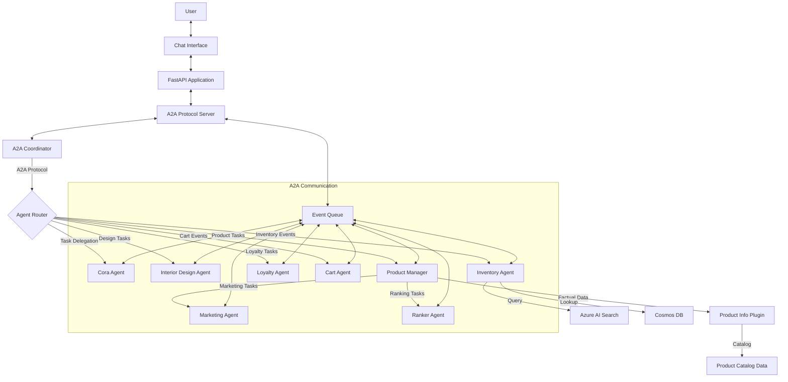

# Demo: Zava AI Shopping Assistant   Multi-Agent Architecture with A2A Protocol - Overview 

Costa Rica

[brown9804](https://github.com/brown9804)

Last updated: 2026-03-19

----------

> [!IMPORTANT]
> Disclaimer: This repository contains a demo of `Zava AI Shopping Assistant`, a multi-agent system implementing Agent-to-Agent (A2A) protocol for e-commerce. It features a fully automated `"Zero-Touch" deployment` pipeline orchestrated by Terraform, which `provisions infrastructure, ingests data, creates specialized AI agents with delegation patterns in MSFT Foundry, and deploys the complete A2A application stack.` Feel free to modify this as needed, it's just a reference. Please refer [TechWorkshop L300: AI Apps and Agents](https://microsoft.github.io/TechWorkshop-L300-AI-Apps-and-agents/), and if needed contact Microsoft directly: [Microsoft Sales and Support](https://support.microsoft.com/contactus?ContactUsExperienceEntryPointAssetId=S.HP.SMC-HOME) for more guidance. There are tons of free resources out there, all eager to support! 

<b>List of References</b> (Click to expand)

  
- [Microsoft Foundry SDKs and Endpoints](https://learn.microsoft.com/en-us/azure/ai-foundry/how-to/develop/sdk-overview?view=foundry&pivots=programming-language-python)
- Microsoft Defender for Cloud (DevOps security):
  - [Connect GitHub to Defender for Cloud](https://learn.microsoft.com/azure/defender-for-cloud/quickstart-onboard-github)
  - [Connect Azure DevOps to Defender for Cloud](https://learn.microsoft.com/azure/defender-for-cloud/quickstart-onboard-devops)
  - [DevOps security permissions and prerequisites](https://learn.microsoft.com/azure/defender-for-cloud/devops-support)
  

<b>Table of Content</b> (Click to expand)

  
- [Deployment Approaches (pick one)](#deployment-approaches-pick-one)
- [Key Features](#key-features)
- [More Security with Microsoft Defender](#more-security-with-microsoft-defender)
  - [If the Azure portal blade errors](#if-the-azure-portal-blade-errors)
- [About A2A Protocol](#about-a2a-protocol)
- [Architecture](#architecture)
- [What Happens Under the Hood](#what-happens-under-the-hood)
- [Verification](#verification)
  

> E.g Web App approach:

  

  
> [!IMPORTANT]
> The deployment process typically takes 15-20 minutes
>
> 1. Pick a deployment approach (Container Apps or App Service)
> 2. Adjust [terraform.tfvars](./terraform-infrastructure/terraform.tfvars) values
> 2. Initialize terraform with `terraform init`. Click here to [understand more about the deployment process](./terraform-infrastructure/README.md)
> 3. Run `terraform apply`, you can also leverage `terraform apply -auto-approve`. 

## Deployment Approaches (pick one)

- **Container Apps (recommended default in this repo)**
  - In `terraform-infrastructure/terraform.tfvars`: set `deployment_target = "containerapps"`
  - Run: `cd terraform-infrastructure` then `terraform apply -var-file terraform.tfvars`

- **App Service (Linux custom container)**
  - In `terraform-infrastructure/terraform.tfvars`: set `deployment_target = "appservice"` and choose `app_service_sku` (e.g. `P0v3`)
  - Run: `cd terraform-infrastructure` then `terraform apply -var-file terraform.tfvars`
   
## Key Features

- **Multi-agent chat orchestration (default runtime)**: WebSocket `/ws` chat app orchestrates multiple agents in a single conversation flow (routing + multi-step handoffs)
- **6-Agent Architecture (real Azure AI Foundry agents)**:
  - **Cora (Shopper)**: Front-facing assistant for general customer queries
  - **Interior Design Specialist**: Design expertise and style recommendations
  - **Inventory Manager**: Stock availability + product lookup coordination
  - **Customer Loyalty**: Rewards and discount-related queries
  - **Cart Manager**: Cart operations and checkout-oriented help
  - **Product Management Specialist**: Handles product-centric workflows and coordinates lookups across services
- **Intent routing + handoff planning**: Classifies user intent and plans a multi-step sequence of agent calls (instead of a single “one agent answers everything” flow)
- **Factual data integration (pipeline-first)**: Terraform runs pipelines that ingest the catalog into **Azure Cosmos DB** and build an **Azure AI Search** index; runtime lookups can be enabled/extended as needed
- **Real persistent agents**: Uses Azure AI Foundry Agents with saved runtime IDs (OpenAI-style `asst_*`) provisioned during deployment
- **Zero-touch deployment**: `terraform apply` provisions infra, ingests data, creates/updates agents, wires secrets/config, and deploys the Container Apps revision
- **UI-visible diagnostics**: Correlated `error_id` responses and optional tracebacks via `A2A_DEBUG=true` for faster troubleshooting
- **Optional A2A server included**: `src/a2a/` contains an A2A-style server framework, but it is not the default Container Apps entrypoint unless you deploy it explicitly

> [!NOTE]
> Visibility-first rollout (recommended for demos):
>
> - Onboard **GitHub connector only** first to validate the Defender dashboards/workbooks.
> - Onboard **Azure DevOps connector** only in a **sandbox org/project**.
> - Keep **PR annotations OFF** initially (no write-back to PRs) until you decide to enable them.

## More Security with Microsoft Defender

> [!IMPORTANT]
> **Defender is enabled by default in this repo's Terraform defaults.** This can incur Azure costs (Defender plans) and will provision DevOps security connector resources that still require a one-time interactive authorization step for GitHub/Azure DevOps.
> To opt out, explicitly set the related variables to `false` in [terraform-infrastructure/terraform.tfvars](terraform-infrastructure/terraform.tfvars).

This repo supports two complementary “Defender” scenarios:

1. **Microsoft Defender for Cloud (workload protection / cloud posture)**
   - This repo includes an opt-in Terraform configuration to enable Defender for Cloud plans at the subscription scope.
   - Toggle via `enable_defender_for_cloud` in [terraform-infrastructure/terraform.tfvars](terraform-infrastructure/terraform.tfvars) (or the example `tfvars` files above).
   - Note: enabling Defender plans can incur Azure costs.

2. **Defender for Cloud DevOps Security (GHAS / ADO aggregation & reporting)**
   - This repo can provision the **connector resources** via Terraform, but onboarding still requires **interactive authorization** to GitHub and/or Azure DevOps in the Azure portal (or providing a one-time OAuth code).
   - This is the feature area that provides the “central dashboard” experience for GHAS-like findings (code scanning, dependency, secrets) across **organizations/projects** (not just individual repos).
   - It can optionally add **Pull Request annotations** (a write-back action) but only when you explicitly enable/configure that feature.

> [!NOTE]
> Opt out (disable Defender): In [terraform-infrastructure/terraform.tfvars](terraform-infrastructure/terraform.tfvars), set:
>
> - `enable_defender_for_cloud = false`
> - `enable_defender_devops_security = false`

### If the Azure portal blade errors

> If the Azure portal **Defender for Cloud → Environment settings** page fails to load with an error like: `ECS feature flags for project 'Defenders' are not initialized (ErrorAcquiringViewModel)`. Use one of these workarounds:

- **Open the connector resource directly** (bypasses the Environment Settings blade):
  - Find the connector resource IDs from Terraform outputs (look for `defender_devops_security_connector_ids`).
  - Open in the portal using this pattern:
    - `https://portal.azure.com/#resource/<connector-resource-id>/overview`
    - Example: `.../providers/Microsoft.Security/securityConnectors/github-connector`
- **List the connector IDs via CLI** (then open them with the URL above): `az resource list -g <rg-name> --resource-type Microsoft.Security/securityConnectors -o table`
- **Browser reset**: try InPrivate/Incognito, disable extensions (ad blockers), and sign out/in.

## About A2A Protocol

`A2A (Agent-to-Agent) Protocol is a standardized communication framework that enables multiple AI agents to collaborate and coordinate tasks seamlessly.` Like a communication pattern for coordinating multiple agents through structured messages, delegation, and (optionally) event-driven workflows. This repo contains **two multi-agent implementations**:

- **Default deployed chat runtime (what the Dockerfile runs)**: WebSocket `/ws` in `src/chat_app_multi_agent.py`, which routes requests and orchestrates **real Azure AI Foundry Agents** in a multi-step handoff sequence.
- **Optional A2A server implementation**: an A2A-style server under `src/a2a/` (routers, coordinator, event/task framework). Use this only if you deploy/run that entrypoint.

> What is A2A Protocol?

- **Agent-to-Agent Communication**: structured messaging between multiple agents
- **Task Coordination**: agents can delegate tasks to specialized agents
- **Event-Driven Architecture (optional)**: event handling for asynchronous workflows
- **Agent Discovery (optional)**: enumerate/register available agents
- **Protocol Standardization**: consistent message formats and APIs

> How this repo implements multi-agent collaboration (default deployment)

- **WebSocket chat interface**: `/ws` endpoint served by `src/chat_app_multi_agent.py`
- **Intent routing**: classifies the user request and selects the primary domain (`src/services/handoff_service.py`)
- **Handoff planning**: builds a multi-step sequence of which agents to call (`src/chat_app_multi_agent.py`)
- **Remote agent execution**: calls Azure AI Foundry Agents using the saved `asst_*` IDs (`src/app/agents/agent_processor.py`)
- **Factual lookups (optional)**: Terraform creates/loads Cosmos DB and Azure AI Search data; the default chat runtime can be extended to query these sources during workflows

> A2A components included in this repo (optional server)

- **A2A server entrypoint**: `src/a2a/main.py`
- **A2A API routers**: `src/a2a/api/`
- **Agent execution framework**: `src/a2a/server/agent_execution.py`
- **Event system**: `src/a2a/server/events/`
- **Task coordination**: `src/a2a/server/tasks.py`
- **Request handlers**: `src/a2a/server/request_handlers.py`
- **Coordinator**: `src/a2a/agent/coordinator.py`
- **Agent implementations (examples)**: `src/app/agents/`
- **Product catalog helper/plugin (if used)**: `src/app/agents/product_information_plugin.py`

> [!IMPORTANT]
> A2A vs the default deployed chat runtime:
>
> - **A2A server path**: event/task oriented framework under `src/a2a/` (only available if you deploy/run that server)
> - **Default path**: `/ws` WebSocket chat + routing + sequential handoffs to real Foundry agents (no event queue required for the default flow)

## Architecture

## What Happens Under the Hood?

> When you run `terraform apply`, the following automated sequence occurs:

1. **Infrastructure Provisioning**:
   - Creates Resource Group, Cosmos DB, MSFT Foundry, AI Search, Storage Account, Key Vault, and Container Registry (ACR).
   - Deploys AI Models (`gpt-4o-mini`, `text-embedding-3-small`).
   - Sets up monitoring (Log Analytics + Application Insights). Optional A2A components (like an in-memory event queue) are part of the app codebase, not separate Azure resources.

      > E.g Web App approach:
      
       

2. **A2A Framework Deployment**:
   - Includes an optional A2A-style server implementation under `src/a2a/` (routers, coordinator, in-memory event queue, monitoring helpers).
   - Note: the default deployed runtime uses `src/chat_app_multi_agent.py` (`/ws`). The A2A server endpoints are only available if you deploy/run the `src/a2a/main.py` entrypoint.

3. **Data Pipeline Execution**:
   - Sets up a Python virtual environment.
   - Ingests `src/data/updated_product_catalog(in).csv` into Cosmos DB.

        > E.g Web App approach: 

        <https://github.com/user-attachments/assets/41bf0976-0ca8-47fe-a2fa-8750bcc6f848>
   
   - Creates and populates an Azure AI Search index with vector embeddings.

        > E.g Web App approach:
        
        <https://github.com/user-attachments/assets/37c4a8cd-73e1-4392-8755-fb018481d8cb>

4. **Enhanced Agent Creation & A2A Registration**:
   - Installs the Azure AI SDKs (`azure-ai-projects` + `azure-ai-agents`) and authenticates via Entra ID.
   - Connects to MSFT Foundry / Agents API for agent hosting.
   - Provisions 6 specialized agents with enhanced A2A-style routing:
     - Core shopping agents (5) plus Product Management Specialist
     - Marketing Agent and Ranker Agent with delegation patterns
     - Product Information Plugin with predefined catalog data
   - Registers all agents with the enhanced A2A discovery service.
   - Configures delegation relationships between Product Manager and specialized agents.
   - Saves the unique runtime Agent IDs (OpenAI-style `asst_*`), endpoints, and configuration to the `.env` file.

      > E.g `Web App approach`
      
      

      > E.g `New Platform`:

      

5. **Application Deployment**:
   - Builds the Docker container with A2A protocol support in the cloud (ACR Build).
   - Deploys the container to Azure Container Apps (default) with the generated Agent IDs, endpoints, and credentials.
   - Updates the running revision so the app picks up the latest agent IDs and configuration.

## Verification

> After deployment completes, verify the system:

1. **Check the App**:
   - The Terraform output will provide the `chat_application_url`.
   - Visit `https://<your-app-name>.azurecontainerapps.io`.
   - You should see the Zava chat interface with multi-agent routing enabled.

      > E.g `Web App approach`
      
       <https://github.com/user-attachments/assets/a1139528-6b37-4ac2-a1cb-771788ff45a4>

2. **Verify A2A Protocol Endpoints**:
   - These endpoints are **only available if you deploy/run the A2A server entrypoint** (`src/a2a/main.py`).
   - A2A Chat API (HTTP): `https://<your-app-name>.azurecontainerapps.io/a2a/chat/message`
   - A2A Chat API (WebSocket): `wss://<your-app-name>.azurecontainerapps.io/a2a/chat/ws`
   - A2A Chat streaming: `https://<your-app-name>.azurecontainerapps.io/a2a/chat/stream`
   - A2A Chat stats: `https://<your-app-name>.azurecontainerapps.io/a2a/chat/stats`
   - Verify agent discovery: `https://<your-app-name>.azurecontainerapps.io/a2a/server/agents`
   - OpenAPI docs (FastAPI default): `https://<your-app-name>.azurecontainerapps.io/docs`

3. **Verify Enhanced Agent Architecture**:
   - Go to the [MSFT Foundry Portal](https://ai.azure.com).
   - Navigate to your project -> **Build** -> **Agents**.
   - You should see all 6 agents listed with enhanced A2A protocol integration:
     - Core agents: Cora, Interior Design, Inventory, Loyalty, Cart Manager
     - Product Management Specialist with delegation capabilities

      > E.g `Web App approach`
      
      <https://github.com/user-attachments/assets/3c562ccd-cff3-4a30-b9f8-44111fb71113>

4. **Test Multi-Agent Routing (UI)**: `Adjust as needed, this is just a base`. For example:

      | Prompt | E.g Output | 
      | --- | --- |
      | **General**:   “Hi, who are you?”   (Routed to **Cora**) |  | 
      | **Design**:    “Recommend modern furniture for my living room”   (Routed to **Interior Design Specialist**) |  | 
      | **Product Comparisons**:    “Compare sectional sofas”   (Routed to **Product Management Specialist**; comparison is handled within that agent) |  | 
      | **Loyalty Details**:   “Give me a summary of my loyalty account benefits”   (Routed to **Customer Loyalty**) |  | 
            
<!-- START BADGE -->

  
  
Refresh Date: 2026-03-19

<!-- END BADGE -->
