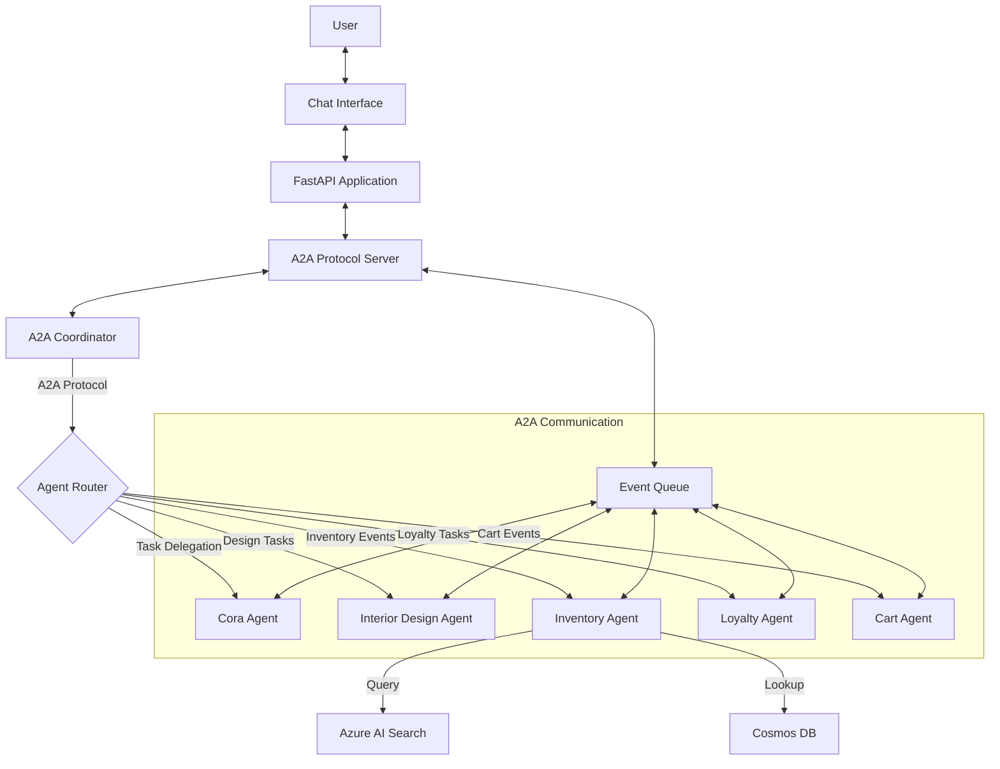

# Demo: Zava AI Shopping Assistant   Multi-Agent Architecture with A2A Protocol - Overview

Costa Rica

[brown9804](https://github.com/brown9804)

Last updated: 2025-12-03

----------

> [!IMPORTANT]
> Disclaimer: This repository contains a demo of `Zava AI Shopping Assistant`, a  multi-agent system designed for e-commerce. It features a fully automated `"Zero-Touch" deployment` pipeline orchestrated by Terraform, which `provisions infrastructure, ingests data, creates real AI agents in MSFT Foundry, and deploys the application container.` Please refer [TechWorkshop L300: AI Apps and Agents](https://microsoft.github.io/TechWorkshop-L300-AI-Apps-and-agents/), and if needed contact Microsoft directly: [Microsoft Sales and Support](https://support.microsoft.com/contactus?ContactUsExperienceEntryPointAssetId=S.HP.SMC-HOME) more guindace. There are tons of free resources out there, all eager to support!

> [!IMPORTANT]
> The deployment process typically takes 15-20 minutes
>
> 1. Adjust [terraform.tfvars](./terraform-infrastructure/terraform.tfvars) values 
> 2. Initialize terraform with `terraform init`. Click here to [understand more about the deployment process](./terraform-infrastructure/README.md)
> 3. Run `terraform apply`, you can also leverage `terraform apply -auto-approve`. 

## Key Features

- **A2A Protocol Implementation**: Complete Agent-to-Agent communication framework with standardized messaging, event handling, and task coordination
- **Multi-Agent Architecture**: Specialized AI agents working through A2A protocol:
  - **Cora (Shopper)**: Front-facing assistant for general queries
  - **Inventory Manager**: Checks stock availability via A2A requests
  - **Customer Loyalty**: Manages rewards and discounts through agent coordination
  - **Cart Manager**: Handles shopping cart operations with inter-agent communication
- **Real Azure AI Agents**: Integrates with **MSFT Foundry** to create and host persistent agents (not just local simulations)
- **Zero-Touch Deployment**: A single [terraform apply](./terraform-infrastructure/README.md) command handles the entire lifecycle including A2A framework deployment
- **A2A Intelligent Routing**: Enhanced Handoff Service that supports both traditional routing and A2A protocol agent discovery
- **Data Pipeline Automation**: Automatically ingests product catalogs with A2A event notifications and coordination

## About A2A Protocol

`A2A (Agent-to-Agent) Protocol is a standardized communication framework that enables multiple AI agents to collaborate and coordinate tasks seamlessly.`

> What is A2A Protocol?

- **Agent-to-Agent Communication**: Structured messaging between multiple AI agents
- **Task Coordination**: Agents can delegate tasks to specialized agents
- **Event-Driven Architecture**: Real-time event handling for agent interactions
- **Agent Discovery**: Automatic detection and registration of available agents
- **Protocol Standardization**: Consistent API for inter-agent communication

> A2A Components in This Project:

- **Agent Execution Framework**: Manages multiple agent instances (`src/a2a/server/agent_execution.py`)
- **Event Queue System**: Handles inter-agent communication (`src/a2a/server/events/`)
- **Task Management**: Coordinates work between agents (`src/a2a/server/tasks.py`)
- **Request Handlers**: Processes agent-to-agent requests (`src/a2a/server/request_handlers.py`)
- **Coordinator Agent**: Orchestrates multi-agent workflows (`src/a2a/agent/coordinator.py`)
- **API Endpoints**: RESTful and WebSocket APIs for agent communication (`src/a2a/api/`)

> A2A vs Traditional Multi-Agent Systems:

- **Standardized Protocol**: Uses consistent message formats and APIs
- **Scalable Architecture**: Easily add new agents without modifying existing ones
- **Real-time Communication**: WebSocket support for instant agent interactions
- **Event-Driven**: Asynchronous event handling for better performance
- **Infrastructure Integration**: Full Terraform deployment with monitoring and automation

## Architecture

## What Happens Under the Hood?

> When you run `terraform apply`, the following automated sequence occurs:

1. **Infrastructure Provisioning**:
   - Creates Resource Group, Cosmos DB, MSFT Foundry, AI Search, Storage Account, Key Vault, and Container Registry (ACR).
   - Deploys AI Models (`gpt-4o-mini`, `text-embedding-3-small`).
   - Sets up A2A protocol infrastructure including event queues and monitoring.

       

2. **A2A Framework Deployment**:
   - Initializes the Agent-to-Agent protocol server components.
   - Sets up event queue system for inter-agent communication.
   - Configures agent discovery and registration services.
   - Deploys A2A monitoring and automation frameworks.

3. **Data Pipeline Execution**:
   - Sets up a Python virtual environment.
   - Ingests `product_catalog.csv` into Cosmos DB with A2A event notifications.

        <https://github.com/user-attachments/assets/41bf0976-0ca8-47fe-a2fa-8750bcc6f848>
   
   - Creates and populates an Azure AI Search index with vector embeddings through A2A coordination.

        <https://github.com/user-attachments/assets/37c4a8cd-73e1-4392-8755-fb018481d8cb>

4. **Agent Creation & A2A Registration**:
   - Installs the `azure-ai-projects` SDK.
   - Connects to MSFT Foundry.
   - Provisions 5 real agents with A2A protocol integration and specific instructions.
   - Registers agents with the A2A discovery service.
   - Saves the unique Agent IDs and A2A endpoints to the `.env` file.

      

5. **Application Deployment**:
   - Builds the Docker container with A2A protocol support in the cloud (ACR Build).
   - Configures the Azure Web App with the generated Agent IDs, A2A endpoints, and credentials.
   - Deploys the container with A2A server components and restarts the app.

## Verification

> After deployment completes, verify the system:

1. **Check the Web App**:
   - The Terraform output will provide the `application_url`.
   - Visit `https://<your-app-name>.azurewebsites.net`.
   - You should see the Zava chat interface with A2A protocol support.

       <https://github.com/user-attachments/assets/a1139528-6b37-4ac2-a1cb-771788ff45a4>

2. **Verify A2A Protocol Endpoints**:
   - Check A2A Chat API: `https://<your-app-name>.azurewebsites.net/a2a/chat`
   - Check A2A Server API: `https://<your-app-name>.azurewebsites.net/a2a/api/docs`
   - Verify agent discovery: `https://<your-app-name>.azurewebsites.net/a2a/server/agents`

3. **Verify Agents**:
   - Go to the [MSFT Foundry Portal](https://ai.azure.com).
   - Navigate to your project -> **Build** -> **Agents**.
   - You should see all 5 agents listed with A2A protocol integration.

      <https://github.com/user-attachments/assets/3c562ccd-cff3-4a30-b9f8-44111fb71113>

4. **Test A2A Interactions**: For example:
   - **General**: "Hi, who are you?" (Handled by Cora via A2A protocol)
   - **Inventory**: "Do you have the classic leather sofa in stock?" (Routed through A2A to Inventory Agent)
   - **Design**: "What colors of green paint do you have?" (A2A task delegation to Design Agent)
   - **Multi-Agent**: "Find a sofa and check my loyalty points" (A2A coordination between multiple agents)

<!-- START BADGE -->

  
  
Refresh Date: 2025-12-03

<!-- END BADGE -->
