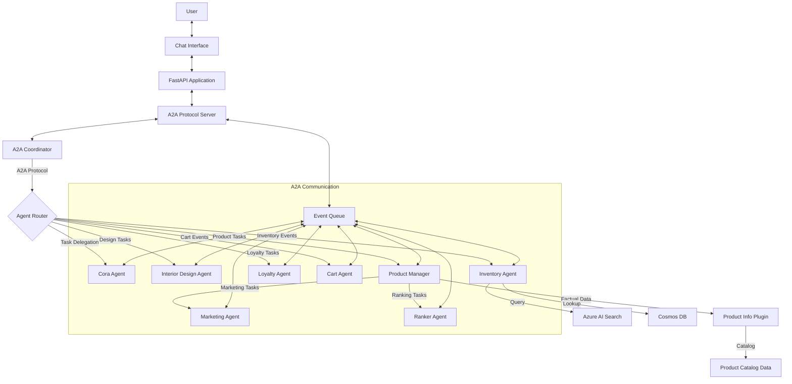

# Demo: Zava AI Shopping Assistant   Multi-Agent Architecture with A2A Protocol - Overview 

Costa Rica

[brown9804](https://github.com/brown9804)

Last updated: 2026-01-29

----------

> [!IMPORTANT]
> Disclaimer: This repository contains a demo of `Zava AI Shopping Assistant`, a multi-agent system implementing Agent-to-Agent (A2A) protocol for e-commerce. It features a fully automated `"Zero-Touch" deployment` pipeline orchestrated by Terraform, which `provisions infrastructure, ingests data, creates specialized AI agents with delegation patterns in MSFT Foundry, and deploys the complete A2A application stack.` Feel free to modify this as needed, it's just a reference. Please refer [TechWorkshop L300: AI Apps and Agents](https://microsoft.github.io/TechWorkshop-L300-AI-Apps-and-agents/), and if needed contact Microsoft directly: [Microsoft Sales and Support](https://support.microsoft.com/contactus?ContactUsExperienceEntryPointAssetId=S.HP.SMC-HOME) for more guidance. There are tons of free resources out there, all eager to support!

<b>List of References</b> (Click to expand)

  
- [Microsoft Foundry SDKs and Endpoints](https://learn.microsoft.com/en-us/azure/ai-foundry/how-to/develop/sdk-overview?view=foundry&pivots=programming-language-python)
  

> E.g 

> [!IMPORTANT]
> The deployment process typically takes 15-20 minutes
>
> 1. Adjust [terraform.tfvars](./terraform-infrastructure/terraform.tfvars) values 
> 2. Initialize terraform with `terraform init`. Click here to [understand more about the deployment process](./terraform-infrastructure/README.md)
> 3. Run `terraform apply`, you can also leverage `terraform apply -auto-approve`. 

## Key Features

- **Enhanced A2A Protocol**: Agent-to-Agent communication with delegation patterns, specialized agent coordination, and factual data integration
- **6-Agent Architecture**: Specialized AI agents with proper delegation through A2A protocol:
  - **Cora (Shopper)**: Front-facing assistant for general customer queries
  - **Interior Design Specialist**: Design expertise and style recommendations  
  - **Inventory Manager**: Stock availability and product lookup coordination
  - **Customer Loyalty**: Rewards management and discount optimization
  - **Cart Manager**: Shopping cart operations and checkout coordination
  - **Product Management Specialist**: Coordinates with Marketing Agent, Ranker Agent, and Product Information Plugin for comprehensive product services
- **Specialized Agent Delegation**: Product Manager delegates marketing tasks to Marketing Agent and ranking tasks to Ranker Agent as appropriate
- **Factual Data Plugin**: Product Information Plugin provides accurate product catalog data from predefined sources
- **Real MSFT Foundry Agents**: Integrates with **MSFT Foundry** to create and host persistent agents with proper delegation patterns
- **Zero-Touch Deployment**: A single [terraform apply](./terraform-infrastructure/README.md) command handles the entire lifecycle including enhanced A2A framework deployment
- **A2A Task Coordination**: Advanced inter-agent task delegation with specialized expertise routing
- **Data Pipeline Automation**: Automatically ingests product catalogs with comprehensive A2A event coordination

## About A2A Protocol

`A2A (Agent-to-Agent) Protocol is a standardized communication framework that enables multiple AI agents to collaborate and coordinate tasks seamlessly.`

> What is A2A Protocol?

- **Agent-to-Agent Communication**: Structured messaging between multiple AI agents
- **Task Coordination**: Agents can delegate tasks to specialized agents
- **Event-Driven Architecture**: Real-time event handling for agent interactions
- **Agent Discovery**: Automatic detection and registration of available agents
- **Protocol Standardization**: Consistent API for inter-agent communication

> A2A Components in This Project:

- **Agent Execution Framework**: Manages multiple agent instances (`src/a2a/server/agent_execution.py`)
- **Event System**: Handles inter-agent communication and delegation (`src/a2a/server/events/`)
- **Task Coordination**: Advanced task delegation between specialized agents (`src/a2a/server/tasks.py`)
- **Request Handlers**: Processes agent-to-agent requests with delegation routing (`src/a2a/server/request_handlers.py`)
- **Coordinator Agent**: Orchestrates complex multi-agent workflows (`src/a2a/agent/coordinator.py`)
- **Specialized Agents**: Marketing Agent, Ranker Agent with delegation patterns (`src/app/agents/`)
- **Product Information Plugin**: Factual data source for product catalog (`src/app/agents/product_information_plugin.py`)
- **API Endpoints**: RESTful and WebSocket APIs for enhanced agent communication (`src/a2a/api/`)

> A2A vs Traditional Multi-Agent Systems:

- **Standardized Protocol**: Uses consistent message formats and APIs
- **Scalable Architecture**: Easily add new agents without modifying existing ones
- **Real-time Communication**: WebSocket support for instant agent interactions
- **Event-Driven**: Asynchronous event handling for better performance
- **Infrastructure Integration**: Full Terraform deployment with monitoring and automation

## Architecture

## What Happens Under the Hood?

> When you run `terraform apply`, the following automated sequence occurs:

1. **Infrastructure Provisioning**:
   - Creates Resource Group, Cosmos DB, MSFT Foundry, AI Search, Storage Account, Key Vault, and Container Registry (ACR).
   - Deploys AI Models (`gpt-4o-mini`, `text-embedding-3-small`).
   - Sets up A2A protocol infrastructure including event queues and monitoring.

      > E.g 
      
       

2. **A2A Framework Deployment**:
   - Initializes the Agent-to-Agent protocol server components.
   - Sets up event queue system for inter-agent communication.
   - Configures agent discovery and registration services.
   - Deploys A2A monitoring and automation frameworks.

3. **Data Pipeline Execution**:
   - Sets up a Python virtual environment.
   - Ingests `product_catalog.csv` into Cosmos DB with A2A event notifications.

        > E.g 

        <https://github.com/user-attachments/assets/41bf0976-0ca8-47fe-a2fa-8750bcc6f848>
   
   - Creates and populates an Azure AI Search index with vector embeddings through A2A coordination.

        > E.g 
        
        <https://github.com/user-attachments/assets/37c4a8cd-73e1-4392-8755-fb018481d8cb>

4. **Enhanced Agent Creation & A2A Registration**:
   - Installs the `azure-ai-projects` SDK and Microsoft Agent Framework.
   - Connects to MSFT Foundry for agent hosting.
   - Provisions 6 specialized agents with enhanced A2A protocol integration:
     - Core shopping agents (5) plus Product Management Specialist
     - Marketing Agent and Ranker Agent with delegation patterns
     - Product Information Plugin with predefined catalog data
   - Registers all agents with the enhanced A2A discovery service.
   - Configures delegation relationships between Product Manager and specialized agents.
   - Saves the unique Agent IDs, delegation endpoints, and A2A configuration to the `.env` file.

      > E.g `Classic UI`
      
      

      > E.g `New Platform`:

      

5. **Application Deployment**:
   - Builds the Docker container with A2A protocol support in the cloud (ACR Build).
   - Configures the Azure Web App with the generated Agent IDs, A2A endpoints, and credentials.
   - Deploys the container with A2A server components and restarts the app.

## Verification

> After deployment completes, verify the system:

1. **Check the Web App**:
   - The Terraform output will provide the `application_url`.
   - Visit `https://<your-app-name>.azurewebsites.net`.
   - You should see the Zava chat interface with A2A protocol support.

      > E.g `Classic UI`
      
       <https://github.com/user-attachments/assets/a1139528-6b37-4ac2-a1cb-771788ff45a4>

2. **Verify A2A Protocol Endpoints**:
   - Check A2A Chat API: `https://<your-app-name>.azurewebsites.net/a2a/chat`
   - Check A2A Server API: `https://<your-app-name>.azurewebsites.net/a2a/api/docs`
   - Verify agent discovery: `https://<your-app-name>.azurewebsites.net/a2a/server/agents`

3. **Verify Enhanced Agent Architecture**:
   - Go to the [MSFT Foundry Portal](https://ai.azure.com).
   - Navigate to your project -> **Build** -> **Agents**.
   - You should see all 6 agents listed with enhanced A2A protocol integration:
     - Core agents: Cora, Interior Design, Inventory, Loyalty, Cart Manager
     - Product Management Specialist with delegation capabilities

      > E.g `Classic UI`
      
      <https://github.com/user-attachments/assets/3c562ccd-cff3-4a30-b9f8-44111fb71113>

4. **Test Enhanced A2A Interactions**: `Adjust as needed, this is just a base`. For example:
   - **General**: "Hi, who are you?" (Handled by Cora via A2A protocol)
   - **Inventory**: "Do you have the classic leather sofa in stock?" (Routed through A2A to Inventory Agent)
   - **Design**: "What colors of green paint do you have?" (A2A task delegation to Design Agent)
   - **Product Recommendations**: "Recommend modern furniture for my living room" (Product Manager delegates to Marketing Agent)
   - **Product Comparisons**: "Compare sectional sofas" (Product Manager delegates to Ranker Agent)
   - **Product Details**: "What are the specifications of product SOFA-001?" (Product Manager uses Product Information Plugin)
   - **Multi-Agent**: "Find a sofa, check reviews, and verify my loyalty points" (Complex A2A coordination across multiple specialized agents)

<!-- START BADGE -->

  
  
Refresh Date: 2026-02-02

<!-- END BADGE -->
