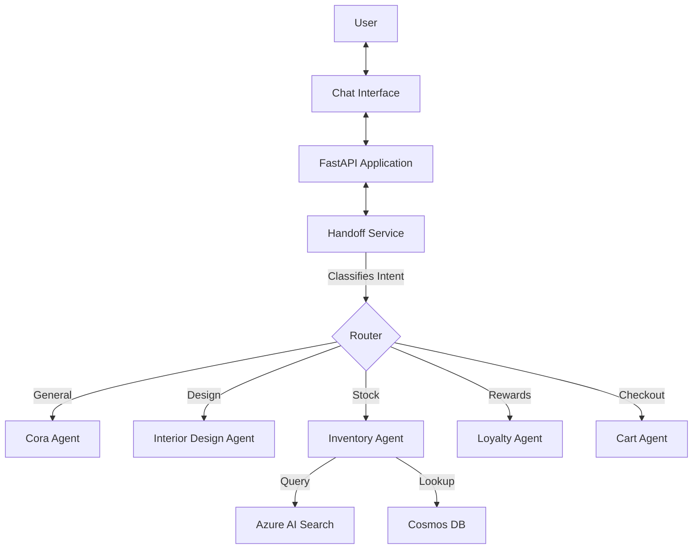

# Demo: Zava AI Shopping Assistant   Multi-Agent Architecture - Overview

Costa Rica

[brown9804](https://github.com/brown9804)

Last updated: 2025-11-12

----------

> [!IMPORTANT]
> Disclaimer: This repository contains a demo of `Zava AI Shopping Assistant`, a  multi-agent system designed for e-commerce. It features a fully automated `"Zero-Touch" deployment` pipeline orchestrated by Terraform, which `provisions infrastructure, ingests data, creates real AI agents in Azure AI Foundry, and deploys the application container.` Please refer [TechWorkshop L300: AI Apps and Agents](https://microsoft.github.io/TechWorkshop-L300-AI-Apps-and-agents/), and if needed contact Microsoft directly: [Microsoft Sales and Support](https://support.microsoft.com/contactus?ContactUsExperienceEntryPointAssetId=S.HP.SMC-HOME) more guindace. There are tons of free resources out there, all eager to support!

## Key Features

- **Multi-Agent Architecture**: Few specialized AI agents working in concert:
  - **Cora (Shopper)**: Front-facing assistant for general queries.
  - **Inventory Manager**: Checks stock availability.
  - **Customer Loyalty**: Manages rewards and discounts.
  - **Cart Manager**: Handles shopping cart operations.
- **Real Azure AI Agents**: Integrates with **Azure AI Foundry** to create and host persistent agents (not just local simulations).
- **Zero-Touch Deployment**: A single [terraform apply](./terraform-infrastructure/README.md) command handles the entire lifecycle from infrastructure to application code.
- **Intelligent Routing**: A dedicated Handoff Service classifies user intent and routes messages to the appropriate specialist agent.
- **Data Pipeline Automation**: Automatically ingests product catalogs into Cosmos DB and builds Vector Search indexes.

## Architecture

> [!IMPORTANT]
> The deployment process typically takes 15-20 minutes

## What Happens Under the Hood?

> When you run `terraform apply`, the following automated sequence occurs:

1. **Infrastructure Provisioning**:
   - Creates Resource Group, Cosmos DB, Azure AI Foundry, AI Search, Storage Account, Key Vault, and Container Registry (ACR).
   - Deploys AI Models (`gpt-4o-mini`, `text-embedding-3-small`). 

       

2. **Data Pipeline Execution**:
   - Sets up a Python virtual environment.
   - Ingests `product_catalog.csv` into Cosmos DB.

        <https://github.com/user-attachments/assets/41bf0976-0ca8-47fe-a2fa-8750bcc6f848>
   
   - Creates and populates an Azure AI Search index with vector embeddings.

        <https://github.com/user-attachments/assets/37c4a8cd-73e1-4392-8755-fb018481d8cb>

3. **Agent Creation**:
   - Installs the `azure-ai-projects` SDK.
   - Connects to Azure AI Foundry.
   - Provisions 5 real agents with specific instructions and tool definitions
   - Saves the unique Agent IDs to the `.env` file.

      

4. **Application Deployment**:
   - Builds the Docker container in the cloud (ACR Build).
   - Configures the Azure Web App with the generated Agent IDs and credentials.
   - Deploys the container and restarts the app.

## Verification

> After deployment completes, verify the system:

1. **Check the Web App**:
   - The Terraform output will provide the `application_url`.
   - Visit `https://<your-app-name>.azurewebsites.net`.
   - You should see the Zava chat interface.

       <https://github.com/user-attachments/assets/a1139528-6b37-4ac2-a1cb-771788ff45a4>

2. **Verify Agents**:
   - Go to the [Azure AI Foundry Portal](https://ai.azure.com).
   - Navigate to your project -> **Build** -> **Agents**.
   - You should see all 5 agents listed.

      <https://github.com/user-attachments/assets/3c562ccd-cff3-4a30-b9f8-44111fb71113>

3. **Test Interactions**: For example:
   - **General**: "Hi, who are you?" (Handled by Cora)
   - **Inventory**: "Do you have the classic leather sofa in stock?" (Handled by Inventory Agent)
   - **Design**: "What colors of green paint do you have?"

<!-- START BADGE -->

  
  
Refresh Date: 2025-12-03

<!-- END BADGE -->
